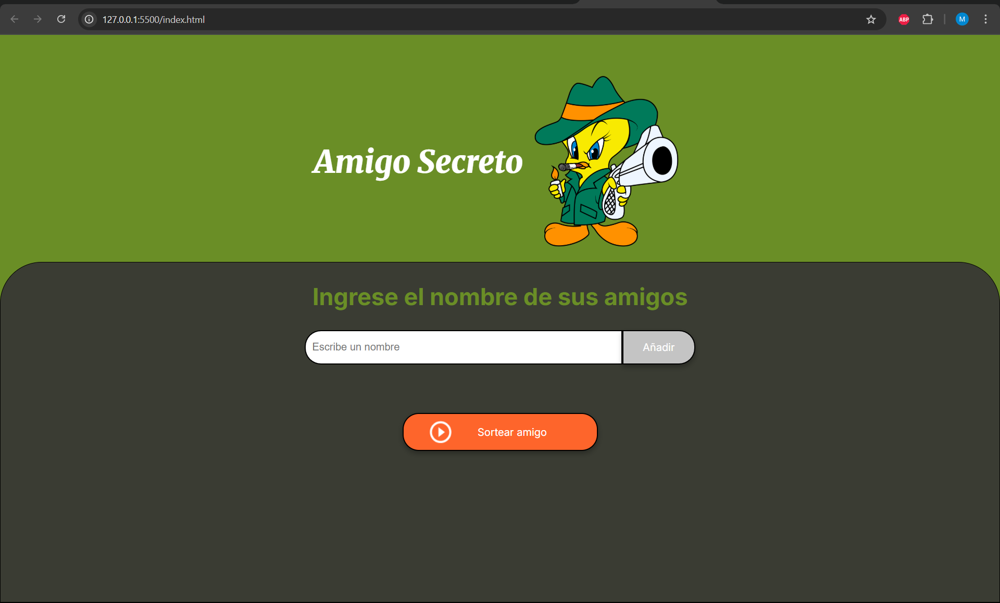

#  Amigo Secreto

Este es un pequeño proyecto web que permite gestionar una lista de amigos y sortear aleatoriamente uno de ellos. Ideal para jugar al "Amigo Invisible" o "Amigo Secreto".

##  Funcionalidades

* Agregar nombres a una lista de amigos.
* Visualizar la lista en tiempo real.
* Sortear aleatoriamente un amigo de la lista.
* Mostrar el resultado en pantalla.

## Vista previa

## Tecnologías usadas

* HTML5
* CSS3
* JavaScript (Vanilla JS)

## Estructura del proyecto
index.html # Página principal
style.css # Estilos personalizados
app.js # Lógica JavaScript
assets/ # Imágenes y otros recursos
